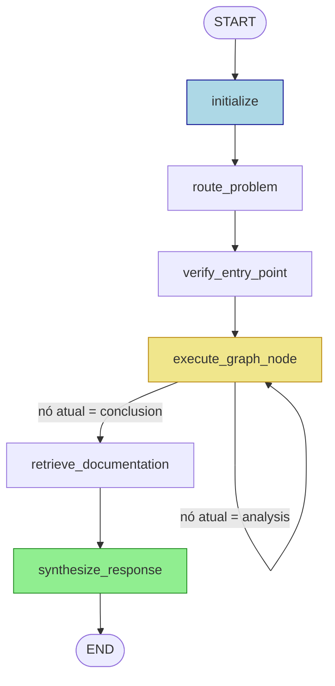

# SDDP Diagnostic Agent — Architecture & Developer Guide

> **Audiência**: Desenvolvedores que nunca viram este projeto antes.  
> **Objetivo**: Entender o que o sistema faz, como é construído, e como cada peça se encaixa.

---

## 1. O que é este projeto?

O **SDDP Diagnostic Agent** é um agente de IA especializado em diagnosticar problemas em simulações do software **SDDP** (Stochastic Dual Dynamic Programming), usado para planejamento da operação de sistemas elétricos.

O SDDP produz um **dashboard HTML** com gráficos de resultados. Este agente:
1. Extrai os gráficos do HTML como arquivos CSV
2. Faz perguntas ao usuário sobre problemas na simulação
3. Navega automaticamente por um **grafo de decisão** (árvore de diagnóstico)
4. Executa análises estatísticas nos dados CSV em cada nó do grafo
5. Chega a uma **conclusão** (nó folha) e gera um diagnóstico estruturado

O sistema é acessível de duas formas:
- **Servidor MCP** (`psr/outputanalysismcp/server.py`) — expõe ferramentas para uso por qualquer cliente MCP (ex: Claude Desktop, Cursor)
- **Agente LangGraph** (`sddp_agent/`) — agente autônomo que conduz o diagnóstico completo automaticamente

---

## 2. Estrutura de Arquivos

```
mcp-psr-output-analysis/
│
├── psr/outputanalysismcp/          # Servidor MCP (expõe ferramentas via protocolo MCP)
│   ├── server.py                   # Definição de todas as tools MCP (@mcp.tool)
│   ├── dataframe_functions.py      # Funções analíticas puras (pandas/numpy)
│   ├── common.py                   # Utilitários compartilhados (read_csv_path, etc.)
│   └── case_information.py         # Parser do HTML para metadados do caso
│
├── sddp_agent/                     # Agente LangGraph autônomo
│   ├── agent.py                    # Monta o StateGraph (wiring de nós e arestas)
│   ├── state.py                    # AgentState (TypedDict) + SessionMemory
│   ├── system_prompt.py            # System prompt SDDP para todas as chamadas LLM
│   │
│   ├── nodes/                      # Cada arquivo = um nó do LangGraph
│   │   ├── __init__.py
│   │   ├── initialize.py           # Exporta HTML→CSV, constrói csv_catalog
│   │   ├── router.py               # Classifica a pergunta em problem_type
│   │   ├── verify_entry.py         # Confirma o nó de entrada do grafo
│   │   ├── graph_navigator.py      # Núcleo: percorre o grafo de decisão
│   │   ├── doc_retriever.py        # Busca documentação em Results.md (nós conclusão)
│   │   └── synthesizer.py          # Gera o diagnóstico final em markdown
│   │
│   ├── prompts/                    # Templates de prompt para cada chamada LLM
│   │   ├── router_prompt.txt
│   │   ├── tool_selector_resolver_prompt.txt   # Seleção + resolução em 1 chamada
│   │   └──  edge_selector_prompt.txt
│   │
│   └── tools/                      # Helpers usados pelo agente
│       ├── graph_loader.py         # Carrega decision_graph.json
│       ├── dataframe_tools.py      # Wrappers que chamam dataframe_functions.py
│       └── catalog.py              # Helpers para o catálogo CSV (_index.json)
│
├── decision-trees/
│   └── decision_graph.json         # ★ Grafo de decisão: nós, arestas, ferramentas
│
├── skills/sddp-diagnose/
│   └── SKILL.md                    # Skill de diagnóstico para o Claude Desktop
│
├── Results.md                      # Documentação técnica SDDP (base de conhecimento)
├── ARCHITECTURE.md                 
└── sddp_agent/CLAUDE.md            # Contexto rápido para desenvolvimento assistido por IA
```

---

## 3. Workflow Completo

### 3.1 Visão de Alto Nível

```
Usuário pergunta sobre um problema SDDP
          │
          ▼
  ┌───────────────┐
  │  INITIALIZE   │  Extrai HTML → CSV; lê _index.json; obtém case_metadata
  └──────┬────────┘
         │  csv_catalog, case_metadata, results_dir → AgentState
         ▼
  ┌───────────────┐
  │ ROUTE_PROBLEM │  LLM classifica a pergunta em problem_type
  └──────┬────────┘    (problema_convergencia | deslocamento_custo |
         │              problema_simulacao | violacao | cmo)
         ▼
  ┌────────────────────┐
  │ VERIFY_ENTRY_POINT │  Confirma nó de entrada do grafo de decisão
  └──────────┬─────────┘
             │  current_node_id → entry node
             ▼
  ┌────────────────────┐ ◄──────────────────────────────────┐
  │ EXECUTE_GRAPH_NODE │                                    │
  │                    │  Para cada aresta saindo do nó:    │
  │  1. LLM seleciona  │    • Seleciona ferramentas         │
  │     e resolve      │    • Resolve file_path + colunas   │
  │     ferramentas    │    • Executa ferramentas (pandas)  │
  │  2. Executa tools  │    • LLM avalia hipótese do filho  │
  │  3. LLM avalia     │  Segue a primeira aresta confirmada│
  │     hipótese       │                                    │
  └──────────┬─────────┘ ─────────────── (loop) ───────────┘
             │  (quando nó atual é do tipo "conclusion")
             ▼
  ┌──────────────────────┐
  │ RETRIEVE_DOCUMENTATION│  Busca seções relevantes de Results.md
  └──────────┬───────────┘
             ▼
  ┌────────────────────┐
  │ SYNTHESIZE_RESPONSE│  LLM compõe diagnóstico final em markdown
  └──────────┬─────────┘
             ▼
       Resposta ao usuário
```

### 3.2 Diagrama LangGraph



### 3.3 O que cada fase carrega no `AgentState`

| Campo no State | Preenchido por | Consumido por |
|---|---|---|
| `study_path` | usuário | initialize |
| `user_query` | usuário | router, synthesizer |
| `csv_catalog` | initialize | navigator, synthesizer |
| `case_metadata` | initialize | router, navigator, synthesizer |
| `results_dir` | initialize | navigator |
| `problem_type` | router | — |
| `entry_point_ranking` | router | verify_entry_point |
| `current_node_id` | router → navigator | navigator, _after_execute |
| `traversal_history` | navigator (append) | _after_execute, synthesizer |
| `tool_results` | navigator (append) | doc_retriever, synthesizer |
| `conclusion_nodes` | doc_retriever (append) | synthesizer |
| `conversation_history` | SessionMemory | router, synthesizer |
| `final_response` | synthesizer | usuário |

---

## 4. Nós do LangGraph — Detalhamento

### 4.1 `initialize` — `nodes/initialize.py`

**O que faz:**
- Lê a pasta do caso SDDP
- Chama `sddp_html_to_csv.export_to_csv()` para exportar todos os gráficos HTML como CSV em `results/`
- Lê `results/_index.json` (catálogo gerado pelo exportador) e constrói `csv_catalog`
- Extrai `case_metadata` do HTML via `case_information.extract_case_information()`

**Sem chamadas LLM** — puro processamento de arquivos.

**Saídas para o state:**
```python
{
  "csv_catalog": {"arquivo.csv": {"chart_type": "band", "title": "...", "series": [...], "rows": 120}},
  "case_metadata": {"run_parameters": {...}, "dimensions": {...}, "non_convexities": {...}},
  "results_dir": "/abs/path/to/results",
}
```

---

### 4.2 `route_problem` — `nodes/router.py`

**O que faz:**
- Usa o LLM para classificar a `user_query` em um `problem_type`
- Retorna também um ranking de todos os nós de entrada por relevância

**Uma chamada LLM** (`router_prompt.txt`):
- Entrada: entry_points do grafo, case_metadata, conversation_history, user_query
- Saída JSON: `{"problem_type": "...", "entry_point_ranking": [...], "reasoning": "..."}`

**Mapeamento problem_type → entry node:**
| `problem_type` | Nó de entrada |
|---|---|
| `problema_convergencia` | `node_root_nao_convergencia` |
| `deslocamento_custo` | `node_deslocamento_custo_sim_politica` |
| `problema_simulacao` | `node_simulacao` |
| `violacao` | `node_violacao` |
| `cmo` | `node_cmo_root` |

---

### 4.3 `verify_entry_point` — `nodes/verify_entry.py`

**O que faz:**
- Percorre o ranking de entry points retornado pelo router
- Confirma qual é o nó de entrada mais adequado para a pergunta atual
- Inicializa `traversal_history` com o nó de entrada confirmado

**Sem chamadas LLM adicionais** (usa o ranking já produzido pelo router).

---

### 4.4 `execute_graph_node` — `nodes/graph_navigator.py` 

Este é o núcleo do agente. É chamado repetidamente em loop até atingir um nó de conclusão.

**Para cada nó de análise:**

```
Para cada aresta saindo do nó atual (ordenadas por priority):
  │
  ├─ [LLM call 1] _select_and_resolve_tools()
  │    Prompt: tool_selector_resolver_prompt.txt
  │    Entrada: nó filho, ferramentas disponíveis, prior_results,
  │             case_metadata, catalog de CSVs, results_dir
  │    Saída: lista de tool specs com file_path e colunas REAIS
  │
  ├─ Executa cada ferramenta selecionada via call_tool()
  │    → chama função Python em dataframe_tools.py
  │    → que chama função em dataframe_functions.py
  │    → retorna dict com resultado
  │
  └─ [LLM call 2] _hypothesis_holds()
       Prompt: edge_selector_prompt.txt
       Entrada: nó filho (expected_state + description), resultados das ferramentas,
                case_metadata, catalog
       Saída: {"holds": true/false, "reasoning": "..."}
       → Se holds=true: segue esta aresta (break)
       → Se nenhuma aresta confirmada: segue aresta de priority=1 (fallback)
```

**LLM calls por nó:**
- 1 call por aresta testada (seleção + resolução de ferramentas)
- 1 call por aresta testada (avaliação de hipótese)
- Máximo = 2 × número de arestas saindo do nó

**Acúmulo no state:**
```python
tool_results.append({
    "node_id": "node_penalidades_altas",
    "results": [
        {"tool_name": "df_analyze_composition", "params": {...}, "result": {...}},
    ]
})
traversal_history.append("node_calibrar_penalidades")
```

---

### 4.5 `retrieve_documentation` — `nodes/doc_retriever.py`

**Ativado quando:** `_after_execute()` detecta que `current_node_id` é do tipo `"conclusion"`.

**O que faz:**
- Lê `documentation.search_intent` do nó de conclusão atual
- Busca por similaridade de palavras-chave nas seções de `Results.md`
- Retorna as `top_k` seções mais relevantes como texto

**Sem chamadas LLM** — busca por token matching (TF simples).

**Saída para o state:**
```python
conclusion_nodes.append({
    "node_id": "node_calibrar_penalidades",
    "label": "Calibrar valores das penalidades",
    "search_intent": "Calibração de penalidades SDDP violações convergência cortes dominados",
    "doc_content": "### Penalidades\n...(texto do Results.md)...",
    "tool_results": [...],  # resultados do ramo que levou a esta conclusão
})
```

---

### 4.6 `synthesize_response` — `nodes/synthesizer.py`

**O que faz:**
- Compõe o diagnóstico final em markdown estruturado
- Cita números reais dos resultados das ferramentas
- Explica a causa raiz com base na documentação de Results.md
- Emite recomendações com tabela de dados de suporte

**Uma chamada LLM** (prompt inline em `_SYNTHESIS_PROMPT`):

**Contexto passado ao LLM:**
| Campo | Conteúdo |
|---|---|
| `user_query` | Pergunta original do usuário |
| `case_metadata` | Dimensões, parâmetros de execução, não-convexidades do caso |
| `traversal_path` | `node_root → node_zinf_zsup_distantes → ... → node_calibrar_penalidades` |
| `conclusions` | Lista de `{label, doc_content, tool_results}` por conclusão |
| `all_tool_results` | Todos os `{node, tool, result}` coletados na travessia |
| `conversation_history` | Últimas 6 mensagens (para detectar idioma e tom) |

**Formato de saída:**
```markdown
## Diagnóstico: Calibrar valores das penalidades

### O que os dados mostram
O custo operativo representa apenas 62% do custo total na iteração 45
(threshold: 80%). As etapas 3 e 7 apresentam custo de penalidade > 30%.

### Causa raiz
As penalidades estão com valores excessivos, dominando a função objetivo
e gerando cortes de Benders que não aproximam corretamente a FCF...

### Recomendação
1. Reduzir o valor de penalidade para as etapas 3 e 7
2. Reexecutar a política com os novos valores

### Dados de Suporte
| Métrica              | Valor encontrado | Limiar  | Status |
|----------------------|-----------------|---------|--------|
| Proporção custo oper.| 62%             | ≥ 80%   | ❌     |
| Etapas críticas      | 3, 7            | 0       | ⚠️     |
```

---

## 5. Chamadas à LLM — Mapa Completo

```
Fase                    Nó LangGraph          Prompt                          Tokens (aprox.)
────────────────────────────────────────────────────────────────────────────────────────────
Classificação           route_problem         router_prompt.txt               ~800 in / 100 out
Sel. + Resolução        execute_graph_node    tool_selector_resolver_prompt   ~1500 in / 400 out
  (1x por aresta)                                                             (por chamada)
Avaliação hipótese      execute_graph_node    edge_selector_prompt.txt        ~800 in / 100 out
  (1x por aresta)
Síntese final           synthesize_response   (inline _SYNTHESIS_PROMPT)      ~3000 in / 1000 out
────────────────────────────────────────────────────────────────────────────────────────────
```

**Modelo usado:** `claude-sonnet-4-6` (padrão) — sobrescrito por `SDDP_AGENT_MODEL` env var.

**O que NÃO usa LLM:**
- Exportação HTML → CSV (Python puro)
- Leitura do catálogo `_index.json`
- Busca de documentação em `Results.md` (token matching)
- Execução das ferramentas `df_*` (funções pandas)

---

## 6. O Grafo de Decisão (`decision_graph.json`)

### 6.1 Estrutura

```json
{
  "graph_id": "flow_decisao_001",
  "entry_points": {
    "problema_convergencia": "node_root_nao_convergencia",
    "cmo": "node_cmo_root"
  },
  "nodes": [
    {
      "id": "node_root_nao_convergencia",
      "type": "analysis",            // "analysis" | "conclusion"
      "label": "Não convergência na política",
      "purpose": "Ponto de entrada para falha de convergência",
      "content": {
        "description": "Avalia se o caso convergiu...",
        "expected_state": "Se Zinf estiver DENTRO do intervalo..."
      },
      "tools": [
        {
          "name": "df_analyze_bounds",
          "params": {
            "target_col": "Zinf",           // placeholder → resolvido pelo LLM
            "lower_bound_col": "Lower_CI",
            "upper_bound_col": "Upper_CI",
            "iteration_col": "Iteration",
            "lock_threshold": 0.005         // parâmetro não-coluna → preservado
          }
        }
      ]
    },
    {
      "id": "node_calibrar_penalidades",
      "type": "conclusion",
      "label": "Calibrar valores das penalidades",
      "documentation": {
        "retrieval_strategy": "similarity",
        "search_intent": "Calibração de penalidades SDDP violações convergência",
        "top_k": 2
      }
    }
  ],
  "edges": [
    {
      "source": "node_root_nao_convergencia",
      "target": "node_zinf_zsup_distantes",
      "priority": 1                         // 1 = testado primeiro
    }
  ]
}
```

### 6.2 Tipos de Nó

| Tipo | Tem `tools[]` | Tem `documentation{}` | Tratamento |
|---|---|---|---|
| `analysis` | ✅ | ❌ | LLM executa ferramentas e avalia hipótese |
| `conclusion` | ❌ | ✅ | `doc_retriever` busca documentação; termina o loop |

### 6.3 Lógica de Traversal

```
Para cada aresta (por priority, crescente):
  1. LLM seleciona ferramentas do NÓ FILHO e resolve parâmetros
  2. Ferramentas são executadas (dados reais)
  3. LLM avalia: os resultados confirmam o expected_state do FILHO?
  4. Se sim → segue esta aresta (break)
  5. Se nenhuma aresta confirmada → segue aresta de priority=1 (fallback)
```

**Importante:** as ferramentas definidas num nó são usadas para verificar a hipótese DAQUELE nó, não do nó pai. O pai oferece contexto; o filho define o teste.

### 6.4 Exemplo de Traversal — Convergência

```
node_root_nao_convergencia
  │  df_analyze_bounds → Zinf fora do intervalo? Sim.
  │
  ├─ [p=1] node_zinf_zsup_distantes  ← LLM confirma: gap estagnado
  │         │
  │         ├─ [p=1] node_penalidades_altas  ← df_analyze_composition
  │         │         │    Operating_Cost < 80% do total? Sim (62%).
  │         │         │
  │         │         └─ [p=1] node_calibrar_penalidades  ← CONCLUSÃO
  │         │                   └─ doc_retriever busca "Calibração penalidades"
  │         │                   └─ synthesizer gera diagnóstico final
  │         │
  │         └─ [p=2] node_baixo_forwards  (não testado — já seguiu p=1)
  │
  └─ [p=2] node_zinf_aproximando_zsup  (não testado — já seguiu p=1)
```

---

## 7. Ferramentas de Análise (`df_*`)

Cada ferramenta existe em **três camadas**:

```
decision_graph.json         dataframe_tools.py              dataframe_functions.py
───────────────────         ──────────────────              ──────────────────────
"name": "df_analyze_bounds" → _wrap_analyze_bounds()    →  analyze_bounds_and_reference()
                               (lê CSV, repassa params)     (pandas puro, retorna dict)
```

### Catálogo de Ferramentas

| Tool name | Função analítica | Caso de uso |
|---|---|---|
| `df_analyze_bounds` | `analyze_bounds_and_reference` | Convergência Zinf vs [Lower_CI, Upper_CI] |
| `df_analyze_stagnation` | `analyze_stagnation` | Detecção de estagnação de série temporal |
| `df_analyze_composition` | `analyze_composition` | Proporção custo operativo vs total |
| `df_filter_above_threshold` | `filter_by_threshold` | Etapas/agentes acima de threshold |
| `df_analyze_heatmap` | `analyze_heatmap` | Status solver MIP por etapa × cenário |
| `df_cross_correlation` | `analyze_cross_correlation` | Correlação ENA × custo operativo |
| `df_analyze_violation` | `analyze_violation` | Análise de violações (sistemática / frequente / sazonal) |
| `df_analyze_cmo` | `analyze_cmo_distribution` | CMO: zeros, negativos, dispersão por cenário |
| `df_get_head` | `get_dataframe_head` | Amostra das primeiras N linhas |
| `df_get_summary` | `get_data_summary` | Estatísticas (mean/std/min/max) por coluna |
| `df_check_nonconvexity_policy` | `psr.factory.load_study_settings` | Verifica NonConvexityRepresentationInPolicy |

### Como o LLM resolve parâmetros

O LLM recebe o catálogo de CSVs disponíveis (com nomes exatos de colunas) e os parâmetros placeholder do grafo, e os resolve em uma única chamada:

```
Placeholder (do grafo):          Resolvido (enviado para call_tool):
───────────────────────          ──────────────────────────────────
"target_col": "Zinf"        →    "target_col": "Zinf"          (exato)
"lower_bound_col": "Lower_CI" → "lower_bound_col": "Zsup +- Tol (low)"
(sem file_path)              →   "file_path": "/case/results/convergencia.csv"
```

---

## 8. Memória de Sessão (`SessionMemory`)

O agente suporta **perguntas múltiplas sobre o mesmo caso** sem re-inicializar.

```python
class SessionMemory:
    study_path: str           # path do caso atual
    csv_catalog: dict         # catálogo de CSVs (persistido)
    case_metadata: dict       # metadados do caso (persistido)
    results_dir: str          # pasta results/ (persistido)
    conversation_history: list # últimas 10 trocas (max 20 msgs)
    last_traversal: list      # caminho percorrido na última pergunta
```

**Fluxo multi-turno:**
1. Primeira pergunta → `initialize` → `route_problem` → ... → resposta
2. `SessionMemory.update_from_state(state)` salva `csv_catalog`, `case_metadata`, `results_dir`
3. Segunda pergunta (mesmo `study_path`) → pula `initialize`, vai direto para `route_problem`
4. `@path/novo/caso` na mensagem → detecta mudança de caso → re-inicializa

---

## 9. Servidor MCP (`psr/outputanalysismcp/server.py`)

O servidor MCP expõe as mesmas capacidades analíticas para **qualquer cliente MCP** (não só o agente LangGraph).

### Ferramentas expostas

| Categoria | Ferramentas MCP |
|---|---|
| Setup | `extract_html_results`, `get_avaliable_results`, `get_case_information` |
| Grafo | `get_graph_entry_point`, `get_graph_node`, `get_conclusion_documentation`, `get_diagnostic_graph` |
| Análise | `df_get_head`, `df_get_summary`, `df_analyze_bounds`, `df_analyze_composition`, `df_analyze_stagnation`, `df_cross_correlation`, `df_analyze_heatmap`, `df_filter_above_threshold`, `df_analyze_violation`, `df_analyze_cmo` |
| Prompt | `sddp_diagnose` (slash command que carrega o SKILL.md) |

### Relação com o agente LangGraph

```
Cliente MCP (ex: Claude Desktop)     Agente LangGraph (sddp_agent/)
────────────────────────────────     ──────────────────────────────
Chama tools manualmente via chat      Orquestra tools automaticamente
LLM do cliente navega o grafo         graph_navigator.py navega o grafo
server.py formata resultado como str  dataframe_tools.py retorna dict
```

Ambos usam as mesmas funções analíticas de `dataframe_functions.py`.

---

## 10. Como Adicionar Novos Nós ao Grafo

### Passo 1 — Defina os nós em `decision_graph.json`

```json
{
  "id": "node_meu_novo_no",
  "type": "analysis",
  "label": "Meu novo nó de análise",
  "purpose": "O que este nó verifica",
  "content": {
    "description": "Descrição detalhada do que analisar",
    "expected_state": "Condição que confirma a hipótese deste nó"
  },
  "tools": [
    {
      "name": "df_analyze_bounds",
      "params": {
        "target_col": "Coluna_Placeholder",
        "lock_threshold": 0.005
      }
    }
  ]
},
{
  "id": "node_minha_conclusao",
  "type": "conclusion",
  "label": "Minha conclusão",
  "purpose": "O que recomendar",
  "documentation": {
    "retrieval_strategy": "similarity",
    "search_intent": "Palavras chave para buscar no Results.md",
    "top_k": 2
  }
}
```

E adicione as arestas:
```json
{ "source": "node_existente", "target": "node_meu_novo_no", "priority": 3 },
{ "source": "node_meu_novo_no", "target": "node_minha_conclusao", "priority": 1 }
```

### Passo 2 — Se precisar de nova ferramenta

1. **`dataframe_functions.py`**: Implemente `nova_funcao(df, ...) -> dict`
2. **`dataframe_tools.py`**: Adicione `_wrap_nova_funcao` + registre em `TOOL_DISPATCH`
3. **`server.py`**: Adicione `@mcp.tool() def df_nova_ferramenta(...) -> str`
4. **`catalog.py`**: Adicione hint de chart_type relevante

### Passo 3 — Se for um novo entry point

Em `decision_graph.json`:
```json
"entry_points": {
  "meu_problema": "node_meu_entry_point"
}
```

Em `router_prompt.txt`, adicione a regra de classificação.

### Passo 4 — Documente em `Results.md`

Adicione seções com as palavras-chave do `search_intent` dos nós de conclusão para que `doc_retriever` as encontre.

---

## 11. Configuração e Dependências

### Variáveis de ambiente

| Variável | Padrão | Descrição |
|---|---|---|
| `ANTHROPIC_API_KEY` | (obrigatório) | Chave da API Anthropic |
| `SDDP_AGENT_MODEL` | `claude-sonnet-4-6` | Modelo Claude usado pelo agente |

### Instalação

```bash
# Instalar o servidor MCP + agente
pip install -e ".[agent]"

# Arquivo .env na raiz
ANTHROPIC_API_KEY=sk-ant-...
SDDP_AGENT_MODEL=claude-sonnet-4-6   # opcional
```

### Dependências principais

```
langgraph>=0.2.0
langchain>=0.3.0
langchain-anthropic>=0.3.0
langchain-core>=0.3.0
pandas
numpy
python-dotenv>=1.0.0
mcp / fastmcp
```

---

## 12. Diagrama de Fluxo de Dados Detalhado

```
HTML do SDDP Dashboard
        │
        │  sddp_html_to_csv.export_to_csv()
        ▼
CSV files + _index.json (results/)
        │
        │  initialize.py → csv_catalog, case_metadata
        ▼
AgentState
  ├─ csv_catalog: {"conv.csv": {chart_type:"band", series:["Zinf","Zsup",...], rows:45}}
  ├─ case_metadata: {run_parameters: {stages:24, series:200, ...}, non_convexities: {...}}
  └─ results_dir: "/case/results"
        │
        │  router.py → LLM classifica pergunta
        ▼
problem_type = "problema_convergencia"
current_node_id = "node_root_nao_convergencia"
        │
        │  graph_navigator.py (loop)
        ▼
  Para aresta → node_zinf_zsup_distantes (priority=1):
    LLM call: "qual CSV usar? quais colunas?"
      → file_path = "/case/results/conv.csv"
      → target_col = "Zinf", lower = "Zsup +- Tol (low)", ...
    call_tool("df_analyze_bounds", resolved_params)
      → analyze_bounds_and_reference(df, "Zinf", ...) → dict
    LLM call: "bounds_status.converged=False + is_locked=True → hipótese do filho?"
      → {"holds": true, "reasoning": "Zinf fora do intervalo e gap estagnado"}
    → segue para node_zinf_zsup_distantes
        │
        │  (continua percorrendo...)
        ▼
current_node_id = "node_calibrar_penalidades" (type=conclusion)
        │
        │  doc_retriever.py
        ▼
Results.md → seções relevantes sobre calibração de penalidades
        │
        │  synthesizer.py → LLM compõe diagnóstico
        ▼
## Diagnóstico: Calibrar valores das penalidades
### O que os dados mostram
  Zinf = 142.350 (fora do intervalo [145.200, 148.900])
  Operating_Cost = 62% do total (threshold: 80%) nas iterações 40-45
  Etapas críticas: 3, 7, 12
...
```
